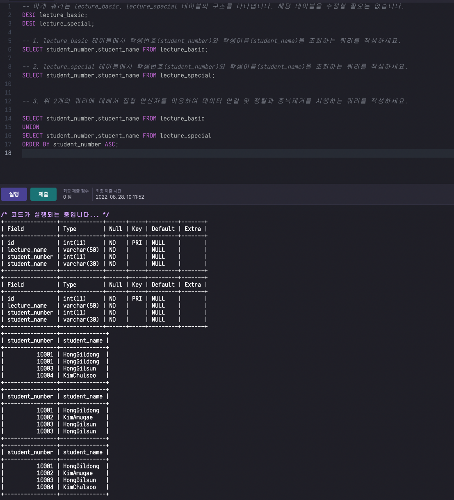
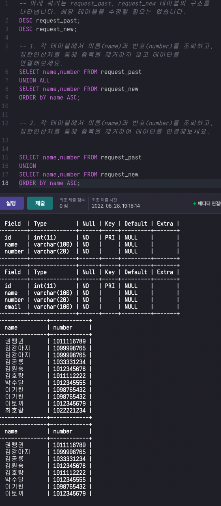
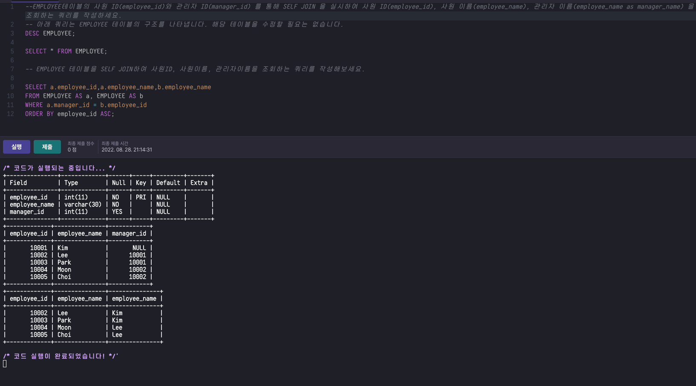

> # SQL_심화
- 1.1 STANDARD SQL
- 1.2 집합 연산자
- 1.3 계층형 질의

> ## 1.1 STANDARD SQL
- `관계형 데이터베이스`에서 `원하는 정보를 유도`하기 위한 기본 연산 집합
    - 일반 집합 연산
    - 순수 관계 연산

- 일반 집합 연산
    - 합집합,교집합,차집합, 카딕션 프로덕트(가능한 모든 경의수를 찾겠다.)
    - 행데이터의 조작
    - 합집합(UNION)
    - 교집합(INTERSECT)
    - 차집합(EXCEPT)
    - 카딕션 곱(CROSS JOIN)
    
- `순수 관계 연산`
    - 셀렉션(SELECTION) : 특정 row
    - 프로젝션(PROJECTION) : 특정 column
    - 조인(JOIN) : 합침
    - 디비전(DIVISION) : 겹치는 부분 추출
    - where절, select절, 다양한 join

> ## 1.2 집합 연산자
- 집합 연산자란?
    - `두개 이상의 테이블`에서 `조인을 사용하지 않고` 연관된 데이터를 조회하는 방법 중 하나이다.
    테이블에서 `SELECT한` `컬럼의 수와 각 칼럼의 데이터타입`이 테이블 간 `상호 호환(즉, 일치해야한다)`이 가능해진다.
    - UNION, UNION ALL, INTERSECT, EXCEPT

> UNION
- `두 개의 테이블`을 하나로 만드는 연산, UNION에 사용할 칼럼의 수와 데이터 형식이 일치해야 하며 합친후에 테이블에서 `중복된 데이터는 제거`
이를 위해 UNION은 테이블을 합칠 떄 `정렬과정`을 발생시킴(하지만 최종 결과에 대해 올바른 정렬을 위해서는 ORDER BY 구문을 사용해야함) `관계형 대수의 일반 집합의 연산에서 합집합의 역활`
---
- A table
|A|B|C|
|---|---|---|
|A1|B1|1|
|A2|B2|2|
|A3|B3|3|
- B table
|A|B|C|
|---|---|---|
|A1|B1|1|
|A4|B4|4|
---
```sql
SELECT * FROM A
UNION
SELECT * FROM B
```

---
|A|B|C|
|---|---|---|
|A1|B1|1|
|A2|B2|2|
|A3|B3|3|
|A4|B4|4|
---




> UNION ALL
- UNION과 달리 중복 제거와 정렬을 하지 않음
- `중복 제거를 하지 않는다`는 것이 제일 중요한 차이점!
```sql
SELECT * FROM A
UNION ALL
SELECT * FROM B
```
---
|A|B|C|
|---|---|---|
|A1|B1|1|
|A2|B2|2|
|A3|B3|3|
|A1|B1|1|
|A4|B4|4|
---




> INTERSELCT
- 두 개의 테이블에 대해 겹치는 부분을 추출하는 연산, `추출 후에는 중복된 결과를 제거`. 관계형 대수의 일반 집합 연산에서 교집합의 역활

- Oracle/Maria Database 에서는 지원 되지만, `MySQL에서는 지원되지 않기` 때문에 추후 학습하는 JOIN등을 활용 해야함
```sql
SELECT * FROM A
INTERSECT
SELECT * FROM B
```
---
|A|B|C|
|---|---|---|
|A1|B1|1|
---


> EXCEPT(MINUS)
- 두 개의 테이블에서 `겹치는 부분`을 앞의 테이블에서 제외하여 추출하는 연산, `추출후에서는 중복된 결과를 제거`
- 관계형 대수의 일반 집합 연산에서 차집합 역활
```sql
SELECT * FROM A
EXCEPT
SELECT * FROM B
```
---
|A|B|C|
|---|---|---|
|A2|B3|2|

---
- OracleDatabase에서는 지원되지만, MariaDB에서 EXCEPT 키워드로 지원함.
- `MySQL에서는 지원되지 않기 떄문에 추후 학습하는 JOIN등`을 활용해야 함

> ## 1.3 계층형 질의
> 계층형 질의란?
- 테이블에 `계층형 데이터가 존재하는 경우` 데이터를 조회하기 위해 사용하는것
- 동일 테이블에 계층적으로`상위`와` 하위` 데이터가 포함되어 있틑 데이터
1. 순환 관계 데이터 모델
2. 계층형 구조
3. 샘플 데이터 

> 계층형 질의 예시(ORACLE)
```sql
SELECT LEVEL, 자식 컬럼,부모칼럼,원하는 컬럼
FROM 테이블명
START WITH 부모 컬럼 IS NULL -- NULL 값인 컬럼이 부모이다. 즉, 부모컬럼이 NULL인 행이 Root(가장 상위)가 됨, 최상위의 data기준
CONNECT BY PRIOR 자식컬럼 = 부모컬럼;
-- 상위 데이터와 하위 데이터의 연결방식, 
```
---
|키워드|설명|
|---|---|
|LEVEL|검색 항목의 깊이를 의미하며, 계층 구조에서 루트(최상위)의 레벨1|
|CONNECT_BY_ROOT|현재 전개할 데이터의 루트(최상위)데이터 값 표시|
|CONNECT_BY_ISLEAF|현재 전개할 데이터가 리프(최하위)데이터 인지에 대한 표시|
|SYS_CONNECT_BY_PATH(A,B)|루트 데이터부터 현재까지 전개할 경로 표시(A: 컬럼명,B: 구분자)|

---

# SQL_심화_2
1. JOIN
1. FROM절 JOIN형태
1. 셀프 조인

> ## 2.1 JOIN(교집합)
- JOIN
- 두 개 이상의 테이블들을 `연결 `또는 `결합하여` 데이터를 출력하는 것
- 연산자에 따라 JOIN방식 분류 시
    - EQUI JOIN
    - Non EQUI JOIN

> EQUI JOIN(등가 교집합)
- `두 개의 테이블 간`에 서로 `정확하게 일치`하는 경우를 활용하는 조인
- 즉 `등가 연산자를 사용한 조인`의 의미
- 대부분 `기본키-외래키 관계를 기반`으로 발생하나, 모든 조인이 그런것은 아니다.

```
기본키(Primary key) : 기본키는 릴레이션을 대표하는 키다. 때문에 기본키를 설정하면 다른 릴레이션의 외래키와 관계를 맺고 상호작용 할수 있다.

- 고려사항
    - 릴레이션 내 튜플을 식별할 수 있는 고유한 값을 가져야한다.
    - NULL값은 허용하지 않는다(중복값이 있으면 안되는 특성상 자연스럽다.)
    - 키 값이 변하지 않아야 한다.
    - 최대한 적은 수의 속성을 가진게 좋다

외래키(Foreign Key) : 외래키는 다른 릴레이션의 기본키를 참조할 키를 말한다. 
    - 관계 데이터 모델의 릴레이션간의 관계를 표현한다.
    - 다른 릴레이션의 기본키를 참조한다.
    - 참조되는 값(기본키)이 변경하면 참조(외래키)하는 값도 변경된다.
    - 참조되고 있는 값은 기본키에서 삭제할 수 없다.
    - NULL값과 중복값이 허용된다.
    - 다른 릴레이션의 기본키를 참조하지 않고 자신의 기본키를 참조하는 외래키도 사용 가능하다.
```

> Non EQUI JOIN(비등가 교집합)
- 두 개의 테이블 간에 서로 `정확하게 일치하지 않는 경우`를 활용하는 조인
- 즉, 등가 연산자 이외의 연산자들을 사용한 조인의 의미
- <,>,<=,>=,BETWEEN


> ## 2.2 FROM절 JOIN형태

> INNER JOIN
- 내부 JOIN이라며 JOIN조건에서 동일한 값이 있는 행만 반환
- INNER JOIN은 JOIN의 기본값으로 `INNER`생략 가능
```sql
SELECT * FROM 테이블1 [INNER] JOIN 테이블2
ON 테이블1.컬럼명 = 테이블2.컬럼명;
--- on구를 사용해 조인의 조건을 지정
```


> USING 조건절
- 같은 이름을 가진 컬럼들 중 원하는 칼럼에 대해서만 선택적으로 등가 조인 가능
```sql
SELECT * FROM 테이블1 JOIN 테이블2
USING (기준 칼럼);
--- USING조건절 사용시에는 칼럼이나 테이블에 별칭을 붙일 수 수 없음
```


>  NATURAL JOIN
- 두 테이블 간의 동일한 이름을 갖는 모든 칼럼들에 대해 등가 조인을 수행
```sql
SELECT * FROM 테이블 NATURAL JOIN 테이블2;
--- 추가로 ON조건절 이나 USING조건절, WHERE절에서 JOIN조건 정의 불가
```
- 실무에서는 거의 안쓰인다.


> CROSS JOIN
- JOIN조건이 없는 경우 생길 수 있는 모든 데이터의 조합을 조회

```sql
SELECT * FROM PERSON
(CROSS) JOIN PUBLIC_TRANSPORT
--- on의 유무에 따라 INNER JOIN과 CROSS JOIN을 구별 할 수 있다.
```


> OUTER JOIN
- 두 개의 테이블 간에 교집합을 조회하고 한쪽 테이블에만 있는 데이터도 포함 시켜서 조회
- 빈 곳은 NULL값으로 출력, WHERE 조건절에서 한쪽에만 있는 데이터를 포함시킬 테이블 쪽으로 (+)를 위치
```sql
SELECT * FROM, USER, CLASS
WHERE USER.CLASS_ID (+)= CLASS.CLASS_ID;
```

- 표준 OUTER JOIN(LEFT JOIN)
```sql
SELECT * FROM USER LEFT[OUTER] JOIN CLASS ON USER.CLASS_ID = CLASS.CLASS_ID;
```


> 표준 OUTER JOIN(RIGHT JOIN)
```sql
SELECT * FROM USER RIGHT [OUTER] JOIN CLASS ON USER.CLASS_ID = CLASS.CLASS_ID;
```


> 표준 OUTER JOIN(FULL OUTER JOIN)
```sql
SELECT * FROM USER FULL OUTER JOIN CLASS ON USER.CLASS_ID = CLASS.CLASS_ID;
```
- UNION은 중복 데이터를 제거한다.(중앙 교집한 부분에 대한 중복을 제거)

```sql
SELECT * FROM USER RIGHT OUTER JOIN CLASS ON USER.CLASS_ID = CLASS.CLASS_ID
UNION
SELECT * FROM USER LEFT OUTER JOIN CLASS ON USER.CLASS_ID = CLASS.CLASS_ID
```


> INNER JOIN
- JOIN을 활용한 쿼리에서도 WHERE문을 이용하여 조건을 걸 수 있음

```sql
SELECT * FROM 테이블1 [INNER] JOIN 테이블2
ON 테이블1.컬럼명 = 테이블2.컬럼명;
WHERE NAME = 'abc';
```


> ## 2.3 셀프 조인
> 셀프 조인이란?
- 동일 테이블 사이의 조인
- 동일 테이블 사이의 조인을 수행하면 테이블과 칼럼 이름이 모두 동일하기 때문에 식별을 위해 별칭 필수
```sql
SELECT A.칼럼명,B.칼럼명
FROM 테이블1.A,테이블1.B
WHERE A.칼럼명2 = B.칼럼명1;
--- 테이블 조인시 별칭을 지정 해줘야 구분 가능
```


