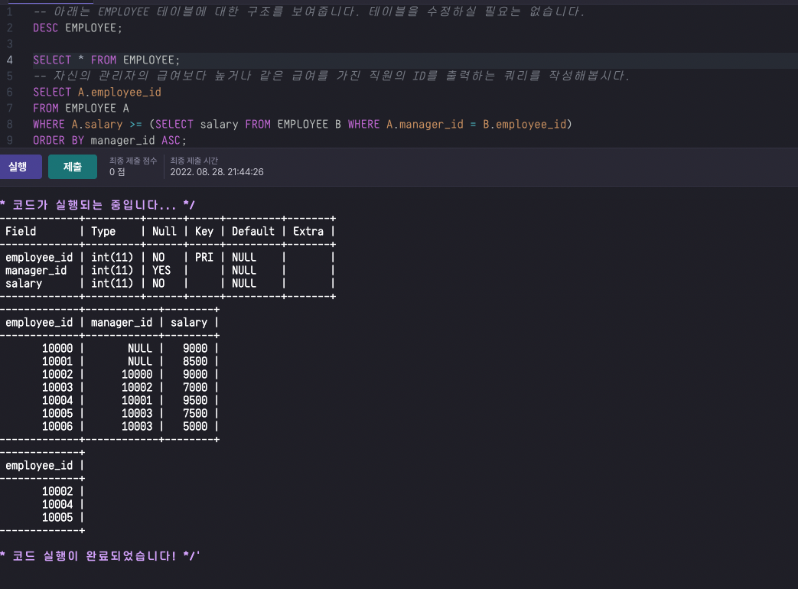
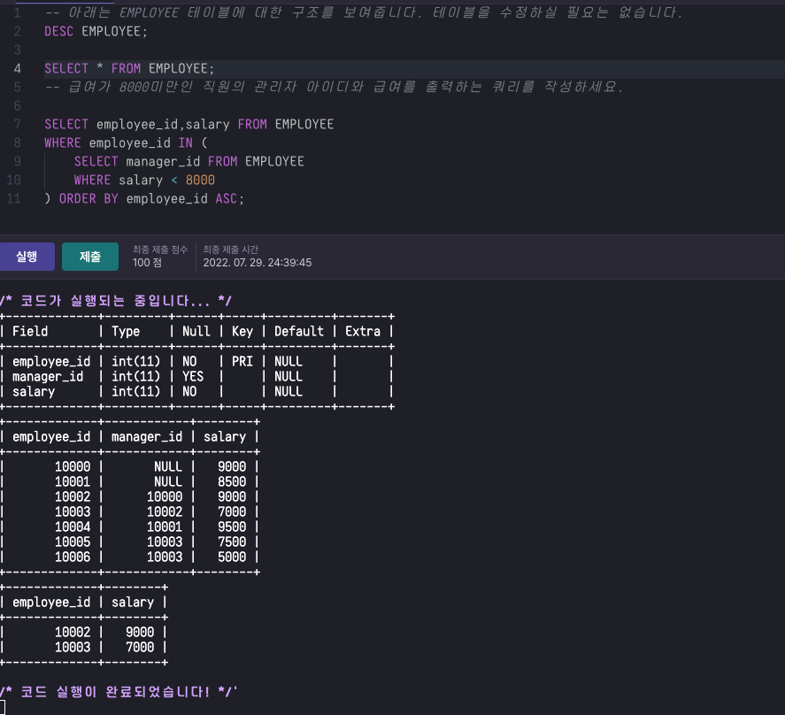
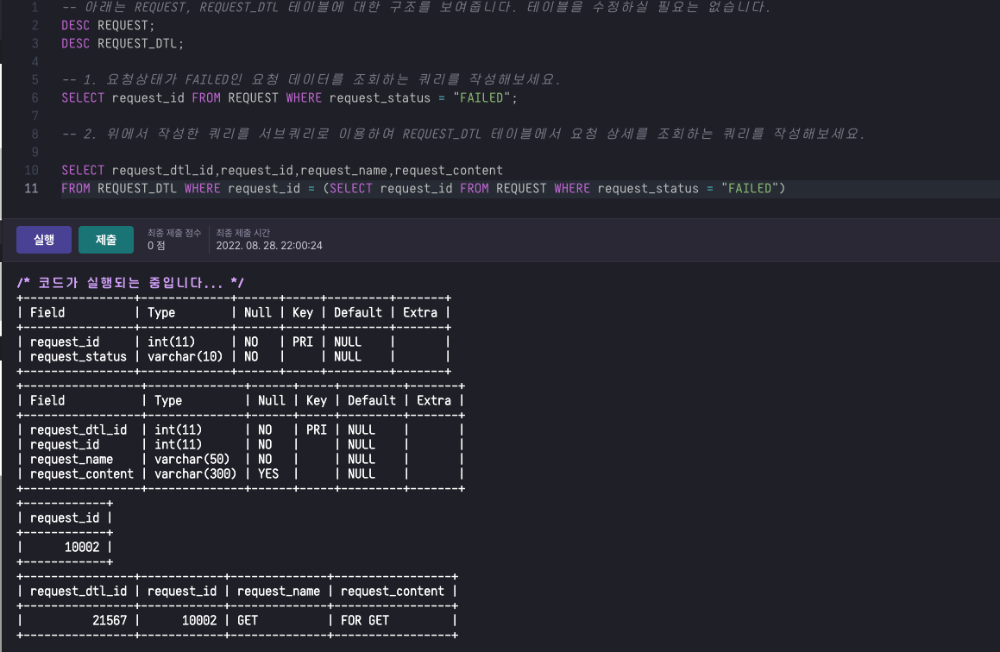
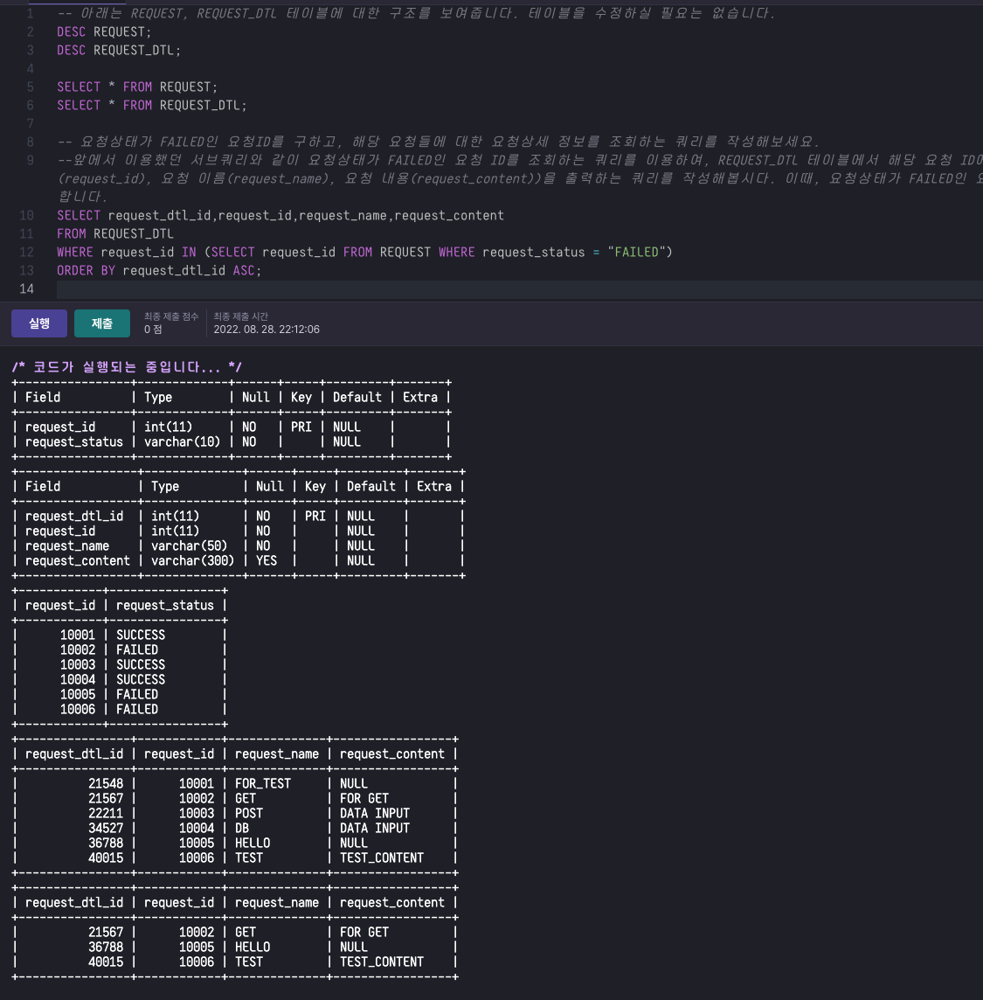
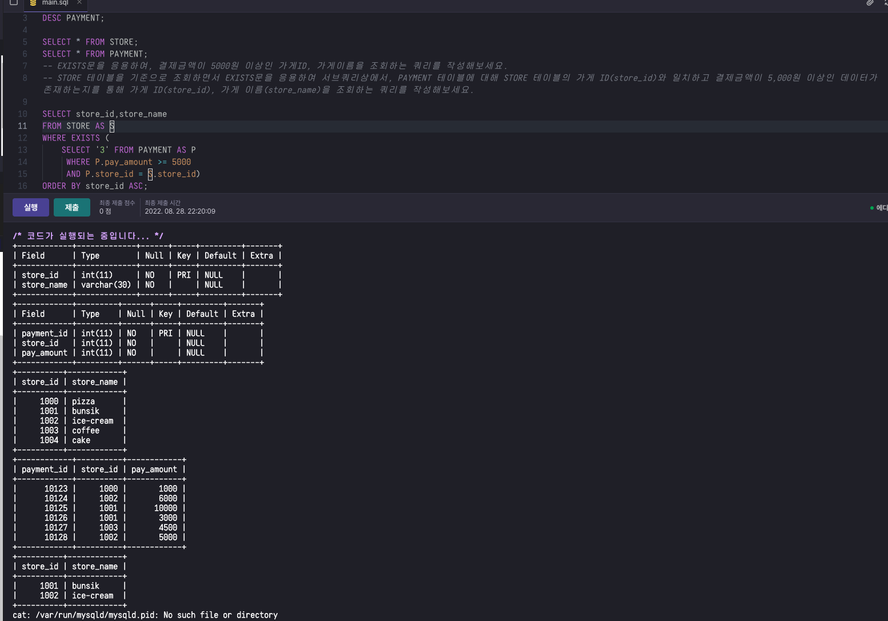
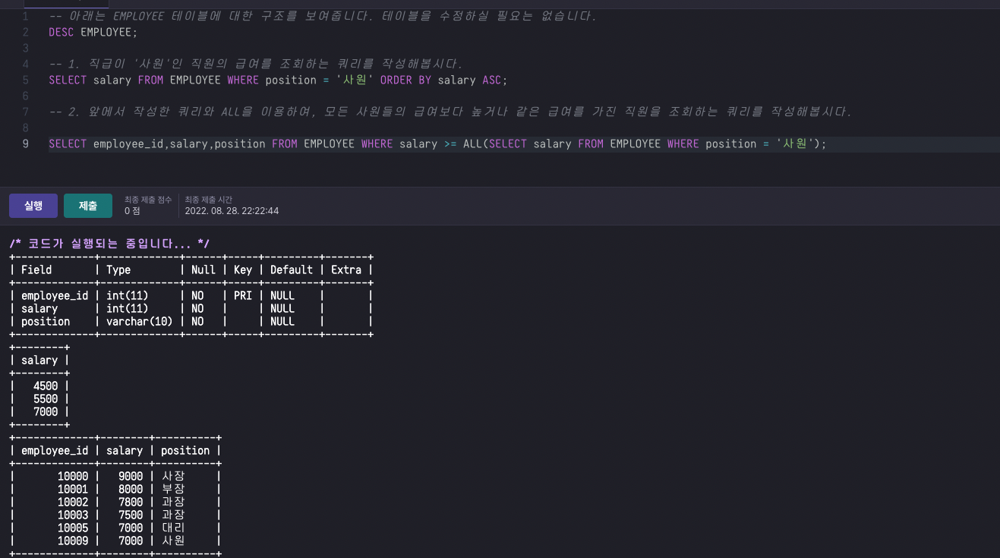
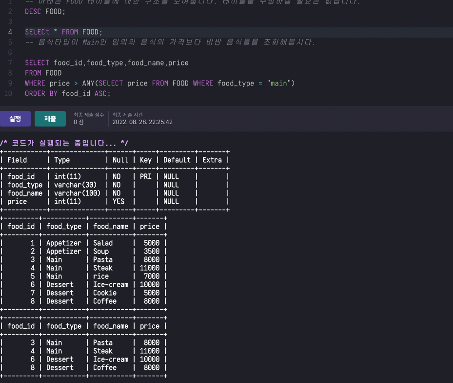
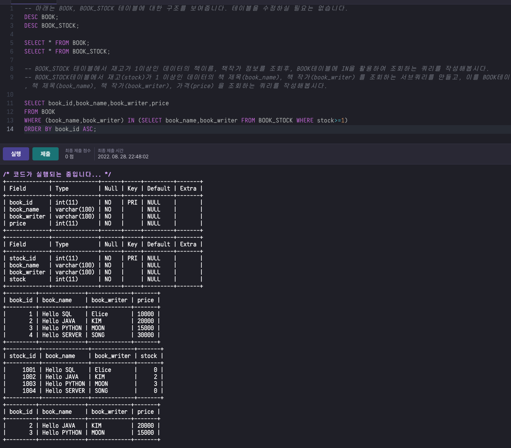
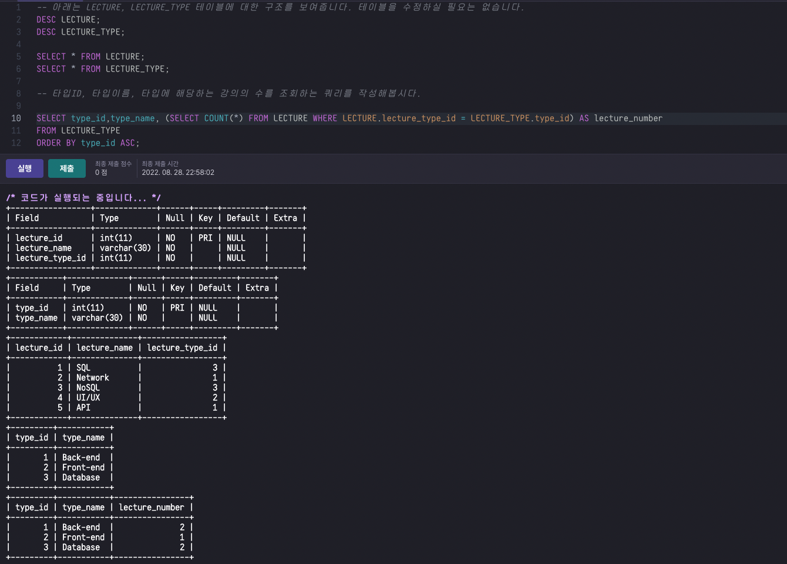

## 3. 서브쿼리 심화
1. 동작하는 방식에 따라 서브쿼리 분류
1. 반환되는 데이터 형태에 따른 서브쿼리 분류
1. 스칼라 서브쿼리
1. 뷰


> ### 3.1 동작하는 방식에 따른 서브쿼리 분류

- 서브 쿼리에 메인 쿼리의 칼럼이 포함되는지에 따라 구분
    - 연관 서브쿼리(Correlated Subquery)
    - 비연관 서브쿼리(Un-Correleated Subquery)

- 연관 서브쿼리
    - 메인쿼리의 컬럼이 서브쿼리에 `포함되며`, 메인 쿼리의 컬럼은 서브 쿼리의 특정 조건으로 사용된다

- 본인이 속한 부서의 평균 급여보다 높은 급여를 받는 직원들을 출력한다.
```sql
SELECT ID,DEPARTMENT_ID,NAME,SALARY
FROM EMPLOYEE_A
WHERE SALARY > (SELECT
                AVG(SALARY)
                FROM EMPLOYEE_B
                WHERE
                B.DEPARTMENT_ID = A.DEPARTMENT_ID)
```
- SALARY라는 컬럼을 subquery에서 사용하였기 때문에 연관서브쿼리이다.

- 비연관 서브쿼리
    - 메인쿼리 컬럼이 서브쿼리에 포함되지 않으며, 주로 메인쿼리에 특정한 값을 제공할 때 사용된다.

- ELICE가 속한 부서의 평균 급여를 출력한다.

```sql


SELECT avg(SALARY)
FROM EMPLOYEE
WHERE DEPARTMNET_ID = (SELECT DEPARTMENT_ID FROM EMPLOYEE WHERE NAME = "ELICE")
-- 급여가 8,000 미만인 직원의 관리자 ID 를 추출하는 서브쿼리를 WHERE문 조건에 응용하고 비연관 서브쿼리 개념을 이용하여, 급여가 8,000 미만인 직원의 관리자 ID(employee_id)와 급여(salary) 를 조회해 봅시다.
```



> ### 3.2 반환되는 데이터 형태에 따른 서브쿼리 분류
- 서브쿼리의 분류
    - 단일 행 서브쿼리(Single Row Subquery)
    - 다중행 서브쿼리 (Multi row subquery)
    - 다중 컬럼 서브쿼리 (Multi Column subquery)

>> 단일행 서브쿼리

- 서브쿼리의 결과가 한개의 행을 반환하며, 단일 행 비교 연산자(<=,=>,<,>,=)과 같이 사용된다.
```sql
-- ELICE가 속한 부서의 직원들을 추출한다.
SELECT ID,NAME,SALARY
FROM EMPLOYEE
WHERE DEPARTMENT_ID = (SELECT DEPARTMENT_ID FROM EMPLOY WHERE NAME = "ELICE")
```


>> 다중 행 서브쿼리
- 서브쿼리의 결과가 두 개 이상 행을 반환할 수 있으며, 다중행 비교 연산자(IN,ALL,ANY,EXISTS)와 같이 사용한다.

|특징|셜명|
|---|---|
|IN|서브쿼리의 결과에 존재하는 값들 중 하나와 일치해야 한다.|
|EXISTS|서브쿼리의 결과 값이 존재하는지 여부를 파악한다.TRUE or FALSE|
|ALL|서크붜르결과에 존재하는 모든 값들에 대한 조건을 만족해야한다.|
|ANY|서브쿼리 결과에 존재하는 값들 중 조건을 만족하는 것이 하나 이상 존재햐아한다.|

- 다중행 서브쿼리 IN
- 영업 또는 개발 팀에 속하는 직원들을 출력한다.
```sql
SELECT NAME
FROM EMPLOYEE
WHERE DEPARTMENT_ID IN (SELECT ID FROM DEPARTMENT WHERE NAME = "품질" OR NAME = "영엉")
```


- 다중행 서브쿼리 EXISTS
- 급여가 10000을 넘는 직원이 존재하는 부서에 소속된 모든 직원을 출력한다
```sql
SELECT NAME
FROM EMPLOYEE A
WHERE
EXISTS(SELECT ID FROM EMPLOYESS B WHERE B.SALARY >=10000 AND A.DEPARTMENT_ID = B.DEPARATMENT_ID)
```


- 다중행 서브쿼리 ALL
- 개발팀 소속 모든 직원들 급여보다 급여가 큰 직원들을 출력한다.
```sql
SELECT NAME
FROM EMPLOYEE
WHERE SALARY >= ALL(SELECT SALARY FROM EMPLOYEE WHERE DEPARTMENT_ID = 1);
```


- 다중행 서브쿼리 ANY
- 개발팀 소속임의의 직원들 급여보다 급여가 큰 직원들을 출력한다.
```sql
SELECT NAME
FROM EMPLOYEE
WHERE SALARY >= ANY(SELECT SALARY FROM EMPLOYEE WHERE DEPARTMENT = 1);
```



> 다중 컬럼 서브쿼리
- 서브쿼리 결과가 여러 개의 컬럼을 반환하며, 메인 쿼리의 조건과 동시에 비교된다.
- 두개 이상의 컬럼을 갖기 때문에 비교할때 조차도 두개 이상의 컬럼을 가지고 비교해야한다
- `각 부서에서 가장 높은 급여를 받는` 직원의 이름과 급여를 출력한다.
```sql
SELECT NAME, SALARY
FROM EMPLOYEE
WHERE (DEPARTMET_ID,SALARY) IN 
(SELECT DEPARTMENT_ID,MAX(SALARY)
FROM EMPLOYEE
GROUP BY DEPARTMENT_ID)
```


> ## 3.3 스칼라 서브쿼리
- 스칼라 서브쿼리는 하나의 속성을 가지면서, 하나의 행만을 반환하는 쿼리이다. 그리고 이는 SELECT,WHERE,HAVING절 등에서 사용할 수 있다.

- 부서명과 부서의 구성원수를 출력한다.
```sql
SELECT NAME, (SELECT COUNT(*) FROM EMPLOYEE E WHERE E.DEPARTMENT_ID = D.ID)
FROM DEPARTMNET D;
```


> 스칼라 서브쿼리 예시 - DUAL
- FROM 을 사용한 특정 테이블 참조 없이 쿼리를 작성하는 경우도 있다.
- 전체 임직원 중에 팀장 직급이 차지하는 비중을 출련한다.
```sql
SELECT
(SELECT COUNT(*) FROM EMPLOYEE WHERE DEPARTMENT = 1) / (SELECT COUNT(*) FROM EMPLOYEE) AS DEVELPER_RATIO
FROM DUAL;
```